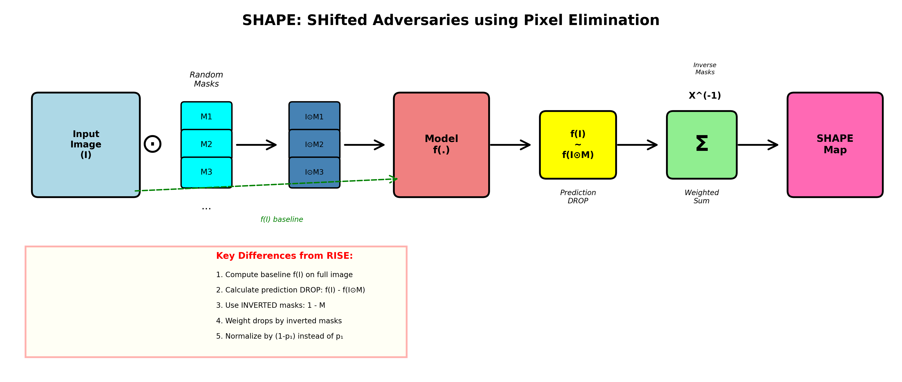
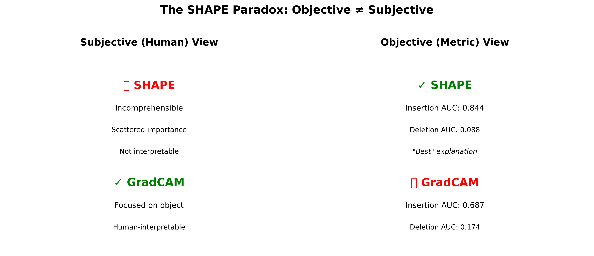

# SHAPE: SHifted Adversaries using Pixel Elimination

[](https://www.python.org/downloads/)
[](https://pytorch.org/)
[](https://opensource.org/licenses/MIT)

**Adversarial Explanations to Question Objective XAI Evaluation Metrics**

This repository implements SHAPE (SHifted Adversaries using Pixel Elimination), a novel adversarial explanation method that exposes fundamental flaws in objective XAI evaluation metrics like insertion and deletion games.

<p align="center">
  
</p>

## 📚 Paper Reference

**"Are Objective Explanatory Evaluation Metrics Trustworthy? An Adversarial Analysis"**

*Prithwijit Chowdhury, Mohit Prabhushankar, Ghassan AlRegib, Mohamed Deriche*

Published in: IEEE International Conference on Image Processing (ICIP) 2024

```bibtex
@inproceedings{chowdhury2024shape,
  title={Are Objective Explanatory Evaluation Metrics Trustworthy? An Adversarial Analysis},
  author={Chowdhury, Prithwijit and Prabhushankar, Mohit and AlRegib, Ghassan and Deriche, Mohamed},
  booktitle={2024 IEEE International Conference on Image Processing (ICIP)},
  pages={3938--3944},
  year={2024},
  organization={IEEE}
}
```

**Key Institution**: OLIVES Lab, Georgia Institute of Technology

---

## 🎯 What is SHAPE?

SHAPE is an **adversarial explanation method** that:

1. ✅ **Mathematically sound** - Based on causal definitions of necessity
2. ✅ **Model-faithful** - Accurately captures model behavior
3. ✅ **Outperforms existing methods** - Achieves better insertion/deletion scores than GradCAM, GradCAM++, and comparable to RISE
4. ❌ **But NOT human-interpretable** - Generates incomprehensible saliency maps

### The Paradox

<p align="center">
  
</p>

**SHAPE reveals a critical flaw**: An explanation can be objectively "better" (higher insertion AUC, lower deletion AUC) while being subjectively useless (unintelligible to humans).

This paradox questions the trustworthiness of causal evaluation metrics for XAI methods.

---

## 🔬 Core Concept

### Necessity-Based Importance

Unlike RISE (which measures **sufficiency** by masking and observing predictions on visible pixels), SHAPE measures **necessity** by removing pixels and observing prediction drops.

**Mathematical Formulation:**

```
N_I,f(λ) = E_M[f(I) - f(I ⊙ M) | M(λ) = 0]
```

Where:
- `I`: Original image
- `M`: Random binary mask
- `f(I)`: Model prediction on full image
- `f(I ⊙ M)`: Model prediction on masked image
- `λ`: Pixel location
- `M(λ) = 0`: Pixel is masked (removed)

**Interpretation**: Importance = Expected prediction drop when pixel is absent

### RISE vs SHAPE

| Aspect | RISE (Sufficiency) | SHAPE (Necessity) |
|--------|-------------------|-------------------|
| **Masks** | Shows visible pixels | Shows masked pixels |
| **Prediction** | On masked image | Baseline - masked |
| **Aggregation** | Weighted by masks | Weighted by inverted masks |
| **Normalization** | By p1 | By (1 - p1) |
| **Interpretation** | "Can these pixels drive prediction?" | "Are these pixels necessary?" |

---

## 🚀 Quick Start

### Installation

```bash
# Clone repository
git clone https://github.com/yourusername/SHAPE-adversarial-explanations.git
cd SHAPE-adversarial-explanations

# Create virtual environment
python -m venv venv
source venv/bin/activate  # On Windows: venv\Scripts\activate

# Install dependencies
pip install -r requirements.txt
```

### Basic Usage

```python
import torch
from torchvision import models
from src.shape import SHAPE
from PIL import Image

# Load pre-trained model
model = models.resnet50(pretrained=True).cuda().eval()

# Initialize SHAPE
explainer = SHAPE(model, input_size=(224, 224), gpu_batch=100)

# Generate or load masks
explainer.generate_masks(N=4000, s=8, p1=0.5, savepath='masks/shape_masks.npy')

# Load and preprocess image
image = Image.open('examples/dog.jpg')
input_tensor = preprocess_image(image).cuda()

# Generate SHAPE explanation
saliency_maps = explainer(input_tensor)

# Get saliency for predicted class
predicted_class = model(input_tensor).argmax().item()
saliency_map = saliency_maps[predicted_class].cpu().numpy()

# Visualize
visualize_saliency(image, saliency_map, save_path='results/dog_shape.png')
```

### Batch Processing

```bash
# Process ImageNet validation set with multiple models
python shape_batch_processor.py \
    --input-dir /path/to/imagenet/val \
    --output-dir shape_outputs \
    --models resnet50 vgg16 densenet161 \
    --p1-values 0.1 0.3 0.5 0.8 \
    --N 4000 \
    --gpu-batch 400
```

---

## 📊 Experimental Results

### Comparison with Popular XAI Methods

<p align="center">
  
</p>

| Method | ResNet50 Insertion ↑ | ResNet50 Deletion ↓ | ResNet101 Insertion ↑ | ResNet101 Deletion ↓ |
|--------|---------------------|--------------------|-----------------------|--------------------|
| **GradCAM** | 0.684 | 0.223 | 0.687 | 0.174 |
| **GradCAM++** | 0.712 | 0.209 | 0.701 | 0.166 |
| **RISE** | 0.769 | 0.091 | 0.788 | 0.150 |
| **SHAPE (Ours)** | **0.771** | **0.104** | **0.844** | **0.088** |

↑ Higher is better | ↓ Lower is better

### Visual Comparison

<p align="center">
  
</p>

**Observation**: SHAPE achieves the best objective scores (insertion/deletion) while producing incomprehensible explanations, revealing the metrics' fundamental flaw.

---

## 🏗️ Repository Structure

```
SHAPE-adversarial-explanations/
│
├── src/
│   ├── shape.py                    # Core SHAPE implementation
│   ├── rise.py                     # RISE baseline for comparison
│   ├── evaluation.py               # Insertion & deletion metrics
│   └── visualization.py            # Visualization utilities
│
├── examples/
│   ├── basic_usage.py              # Simple example
│   ├── compare_methods.py          # Compare SHAPE vs RISE vs GradCAM
│   └── evaluate_metrics.py         # Reproduce paper results
│
├── shape_batch_processor.py        # Batch processing script
├── requirements.txt                # Python dependencies
├── README.md                       # This file
│
├── docs/
│   ├── methodology.md              # Detailed explanation
│   ├── api_reference.md            # API documentation
│   └── faq.md                      # Frequently asked questions
│
├── images/
│   └── (visualization outputs)
│
└── results/
    └── (experimental outputs)
```

---

## 🔧 Core Components

### 1. SHAPE Class

```python
class SHAPE(nn.Module):
    """
    SHifted Adversaries using Pixel Elimination
    
    Generates adversarial explanations based on necessity.
    Only 5 lines different from RISE implementation!
    """
    def __init__(self, model, input_size, gpu_batch=100):
        super(SHAPE, self).__init__()
        self.model = model
        self.input_size = input_size
        self.gpu_batch = gpu_batch
    
    def forward(self, x):
        # Get baseline prediction
        baseline_pred = self.model(x)
        
        # Apply masks and get predictions
        masked_preds = ... # predictions on masked images
        
        # Compute prediction DROP
        pred_drop = baseline_pred - masked_preds
        
        # Use INVERTED masks to credit MASKED pixels
        inverted_masks = 1.0 - self.masks
        
        # Aggregate and normalize
        saliency = matmul(pred_drop, inverted_masks) / N / (1 - p1)
        
        return saliency
```

### 2. Evaluation Metrics

```python
def insertion_game(model, image, saliency_map, steps=100):
    """
    Insertion Game: Add pixels in order of importance
    Higher AUC = Better explanation
    """
    # Start with blank image
    # Progressively add most important pixels
    # Record prediction probability curve
    # Return AUC
```

```python
def deletion_game(model, image, saliency_map, steps=100):
    """
    Deletion Game: Remove pixels in order of importance
    Lower AUC = Better explanation
    """
    # Start with full image
    # Progressively remove most important pixels
    # Record prediction probability curve
    # Return AUC
```

---

## 📖 Key Insights from the Paper

### 1. The Adversarial Nature

> "Our adversarial technique outperforms existing visual explanations in these evaluation metrics. Hence, our work motivates the need for devising objective explanatory evaluation techniques that match subjective human opinions."

### 2. Why SHAPE "Works" Objectively

- **Mathematically grounded** in causal necessity
- **Model-faithful** to prediction behavior
- **Optimizes directly** for what metrics measure

### 3. Why SHAPE Fails Subjectively

- Highlights **non-semantic** regions
- Produces **scattered** importance maps
- **Not interpretable** by humans
- Does NOT help understand model decisions

### 4. The Core Problem

**Causal features ≠ Pixel patterns**

The paper argues:
> "While predictive features may suffice for accurate predictions in normal circumstances, causal features are indispensable for maintaining accuracy even in the face of corruptions. Consequently even minor alterations can trigger substantial shifts in the representation."

---

## 🎓 Understanding the Method

### Why Only 5 Lines Different from RISE?

Both methods use the same random masking framework, but differ in:

| Line | RISE | SHAPE |
|------|------|-------|
| 1 | No baseline | **Get baseline prediction** |
| 2 | Use predictions directly | **Compute prediction DROP** |
| 3 | Use original masks | **Invert masks (1 - mask)** |
| 4 | Weight by masks | **Weight by inverted masks** |
| 5 | Normalize by p1 | **Normalize by (1 - p1)** |

### Conceptual Difference

**RISE asks**: "What pixels are sufficient to produce this prediction?"
- Shows visible pixels → measures sufficiency
- High importance = prediction maintained when shown

**SHAPE asks**: "What pixels are necessary for this prediction?"
- Shows masked pixels → measures necessity  
- High importance = prediction drops when removed

---

## 🔬 Reproducing Paper Results

### Table 1: Mean Insertion & Deletion Scores

```bash
python examples/evaluate_metrics.py \
    --dataset imagenet \
    --models resnet50 resnet101 vgg16 \
    --methods gradcam gradcam++ rise shape \
    --n-samples 1000 \
    --output results/table1.csv
```

### Figure 1: Rooster Example

```bash
python examples/reproduce_figure1.py \
    --image examples/rooster.jpg \
    --model resnet50 \
    --output results/figure1/
```

### Figure 3: Bull Mastiff Example

```bash
python examples/reproduce_figure3.py \
    --image examples/bull_mastiff.jpg \
    --model resnet101 \
    --classes "bull_mastiff" "tiger_cat" "tabby" \
    --output results/figure3/
```

### Figure 4: Great White Shark Comparison

```bash
python examples/reproduce_figure4.py \
    --image examples/shark.jpg \
    --model resnet50 \
    --methods gradcam gradcam++ rise shape \
    --output results/figure4/
```

---

## 💡 Use Cases

### ✅ What SHAPE is Good For

1. **Testing evaluation metrics** - Expose flaws in objective measures
2. **Research purposes** - Study the gap between objective and subjective quality
3. **Benchmark** - Test if metrics can distinguish good from adversarial explanations
4. **Model analysis** - Understand what models truly rely on (not just semantic features)

### ❌ What SHAPE is NOT Good For

1. **Practical XAI** - Not useful for end-users
2. **Trust building** - Does not help humans understand models
3. **Production systems** - Not deployable in real applications
4. **Feature visualization** - Does not show interpretable patterns

---

## 🤔 Frequently Asked Questions

### Q: If SHAPE is not human-interpretable, what's the point?

**A**: SHAPE is an **adversarial example for evaluation metrics**, not a practical XAI method. It demonstrates that:
- Current metrics can be fooled
- Objective scores don't guarantee subjective quality
- We need better evaluation methods

### Q: Should I use SHAPE in my application?

**A**: **No**. Use RISE, GradCAM, or other established methods. SHAPE is a research tool to question evaluation metrics, not a production XAI method.

### Q: How is this different from adversarial attacks on models?

**A**: 
- **Adversarial attacks**: Fool the model's prediction
- **SHAPE**: Fools the XAI evaluation metrics
- Both expose vulnerabilities in their respective targets

### Q: Can SHAPE be used with any model?

**A**: Yes, SHAPE is model-agnostic like RISE. Works with any classifier.

---

## 🛠️ Advanced Usage

### Custom Mask Generation

```python
# Generate masks with different parameters
explainer.generate_masks(
    N=8000,           # More masks = smoother explanations
    s=10,             # Larger grid = finer details
    p1=0.3,           # Lower p1 = more masking
    savepath='custom_masks.npy'
)
```

### Multi-GPU Processing

```python
# Use DataParallel for faster processing
model = nn.DataParallel(model, device_ids=[0, 1, 2, 3])
explainer = SHAPE(model, input_size=(224, 224), gpu_batch=800)
```

### Custom Evaluation

```python
from src.evaluation import evaluate_explanation

results = evaluate_explanation(
    model=model,
    image=image,
    saliency_map=saliency_map,
    metrics=['insertion', 'deletion', 'pointing_game'],
    steps=224  # Fine-grained evaluation
)
```

---

## 📚 Related Work

### Necessity & Sufficiency in XAI

1. **Watson et al. (2021)** - "Local Explanations via Necessity and Sufficiency"
2. **Chowdhury et al. (2023)** - "Explaining Explainers: Necessity and Sufficiency in Tabular Data"

### XAI Evaluation Metrics

1. **Petsiuk et al. (2018)** - "RISE: Randomized Input Sampling for Explanation" (Insertion/Deletion)
2. **Fong & Vedaldi (2017)** - "Interpretable Explanations by Meaningful Perturbation"

### Adversarial Examples

1. **Goodfellow et al. (2015)** - "Explaining and Harnessing Adversarial Examples"
2. **Akhtar & Mian (2018)** - "Threat of Adversarial Attacks on Deep Learning"

---

## 🐛 Troubleshooting

### Issue: Out of Memory

```bash
# Reduce gpu_batch size
explainer = SHAPE(model, input_size=(224, 224), gpu_batch=50)
```

### Issue: Slow mask generation

```bash
# Generate masks once and reuse
explainer.generate_masks(N=4000, s=8, p1=0.5, savepath='masks.npy')

# Later, just load
explainer.load_masks('masks.npy')
```

### Issue: SHAPE masks look too scattered

This is **expected behavior**. SHAPE is adversarial and produces incomprehensible explanations. If you want interpretable explanations, use RISE or GradCAM instead.

---

## 👥 Authors & Contact

**Prithwijit Chowdhury** - pchowdhury6@gatech.edu
**Mohit Prabhushankar** - mohit.p@gatech.edu
**Ghassan AlRegib** - alregib@gatech.edu
**Mohamed Deriche** - m.deriche@ajman.ac.ae

**Affiliation**: OLIVES Lab, Georgia Institute of Technology

**Lab Website**: [OLIVES @ Georgia Tech](https://ghassanalregib.info/)

---

## 📄 License

This project is licensed under the MIT License - see the [LICENSE](LICENSE) file for details.

---

## 🙏 Acknowledgments

- RISE implementation inspired by Petsiuk et al. (2018)
- GradCAM comparisons using pytorch-grad-cam library
- Research supported by Georgia Institute of Technology

---

## 📌 Citation

If you use SHAPE in your research, please cite:

```bibtex
@inproceedings{chowdhury2024shape,
  title={Are Objective Explanatory Evaluation Metrics Trustworthy? An Adversarial Analysis},
  author={Chowdhury, Prithwijit and Prabhushankar, Mohit and AlRegib, Ghassan and Deriche, Mohamed},
  booktitle={2024 IEEE International Conference on Image Processing (ICIP)},
  pages={3938--3944},
  year={2024},
  organization={IEEE},
  doi={10.1109/ICIP51287.2024.10647779}
}
```

---

## 🔗 Links

- 📄 [Paper (IEEE Xplore)](https://ieeexplore.ieee.org/document/10647779)
- 🏛️ [OLIVES Lab](https://ghassanalregib.info/)
- 💻 [GitHub Repository](https://github.com/yourusername/SHAPE-adversarial-explanations)
- 📧 [Contact](mailto:pchowdhury6@gatech.edu)

---

**⚠️ Important Note**: SHAPE is a research tool designed to expose flaws in XAI evaluation metrics. It is NOT intended for practical use in explaining model decisions to end-users. For production XAI applications, use established methods like RISE, GradCAM, or SHAP.
